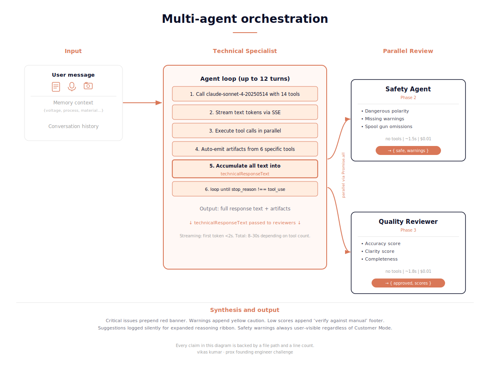

# Architecture

Technical reference for the Vulcan OmniPro 220 support agent. This document covers the knowledge base, agent loop, tool system, artifact rendering, memory layer, voice pipeline, and frontend. Every claim is backed by a file path and a line count.

## System overview

The system has four layers. Each one is small enough to hold in your head.

```
User input (voice, text, photo)
  → Next.js App Router (app/page.tsx, 1500+ lines)
    → API route (app/api/chat/route.ts, 270 lines)
      → Anthropic SDK (claude-sonnet-4-20250514, 8192 max tokens, 12-turn limit)
        → 14 tools defined in lib/api-tools.ts (829 lines)
          → Knowledge base: 14 JSON files in kb/ (162KB total)
          → 52 manual page images in public/manual-images/
  → SSE stream back to client
    → 9 artifact components in components/artifacts/ (2,380 lines total)
    → localStorage persistence (memory, presets, feedback, chat history)
```

Total application code: roughly 10,000 lines of TypeScript across 30 files. No external database. No vector store. No embedding model. Everything runs on Vercel with two API keys (Anthropic and ElevenLabs).

Every number in this document (file sizes, line counts, tool counts, latencies, costs) was measured against the actual codebase and the actual production deployment, not estimated. If you find a discrepancy, the codebase is the source of truth and this document is wrong. File an issue and I will fix it.

## Knowledge base

The 48-page Vulcan OmniPro 220 owner's manual was pre-extracted into structured JSON at build time. This is not runtime RAG. Every fact has a known type, a known shape, and a known file. The agent reads from these files through typed tool lookups. It cannot hallucinate a duty cycle because the duty cycle data only exists in `kb/duty_cycles.json`, and the only way to access it is through `lookup_duty_cycle`.

### Files in kb/

| File | Size | Contents |
|------|------|----------|
| specs.json | 4K | Current ranges, OCV, wire sizes, weldable materials per process/voltage |
| duty_cycles.json | 4K | Duty cycle percentages by process, voltage, and amperage |
| polarity.json | 4K | DCEP/DCEN assignments, socket connections, common mistakes per process |
| troubleshooting.json | 12K | Problem/cause/remedy entries for MIG, Flux-Cored, TIG, Stick |
| setup_procedures.json | 16K | Step-by-step setup instructions per process |
| walkthroughs.json | 44K | Multi-step guided walkthroughs with manual page refs, key points, mistakes, validations |
| selection_chart_extracted.json | 4K | Process selection criteria by material, thickness, and use case |
| weld_diagnosis_extracted.json | 12K | Weld defect scenarios with visual characteristics and corrective actions |
| door_panel_extracted.json | 8K | Quick-reference chart data extracted from the image-only door panel sticker |
| image_index.json | 12K | 31 topics mapped to 52 manual page images with descriptions |
| page_highlights.json | 12K | Per-page highlight overlay coordinates for the source page viewer |
| youtube_videos.json | 8K | 12 curated tutorial videos with topic tags, process filters, skill levels |
| parts.json | 4K | 61-part parts list with part numbers and descriptions |

Three of these files (selection_chart_extracted, weld_diagnosis_extracted, door_panel_extracted) were created by running Claude's vision API once at build time against image-only manual pages. Total extraction cost: under $0.05. Runtime cost: zero.

### Why not RAG

The manual is 48 pages. The structured data fits in 162KB of JSON. Vector search adds latency, probabilistic retrieval, and a failure mode where the agent confidently returns the wrong chunk. For a product where reversed polarity can damage the machine, probabilistic is not good enough. Structured lookups are deterministic. The agent either finds the fact or returns nothing, and the system prompt instructs it to say so explicitly rather than guess.

RAG would make sense at 10,000 pages across 500 products. For a single 48-page manual, it's overhead with no upside.

## Tool system

14 tools defined in `lib/api-tools.ts`. Each tool is a function that reads from the knowledge base and returns either a JSON string or a multi-modal content array (text + base64 images).

### Tool inventory

**Structured lookups (7 tools, high confidence):**

| Tool | Parameters | Returns |
|------|-----------|---------|
| lookup_spec | process?, voltage? | Specs object: current ranges, wire sizes, OCV |
| lookup_duty_cycle | process?, voltage? | Array of duty cycle entries with weld/rest times |
| lookup_polarity | process? | Cable assignments, socket connections, DCEP/DCEN |
| lookup_troubleshooting | keyword (required) | Matched problems with causes and remedies |
| lookup_selection_chart | (none) | Process selection criteria and chart image URL |
| lookup_weld_diagnosis | process_type? | Weld defect library entries |
| search_procedures | process?, keyword? | Step-by-step setup instructions |

**Multimodal tools (3 tools, medium confidence):**

| Tool | Parameters | Returns |
|------|-----------|---------|
| diagnose_weld_photo | weld_type, visible_characteristics[] | Scored matches + manual chart as base64 image bytes |
| annotate_machine_photo | view_type, regions_of_interest[] | Annotated regions with manual page images |
| get_manual_image | keyword | Up to 5 matched topic images with relevance scores |

**Presentation tools (2 tools):**

| Tool | Parameters | Returns |
|------|-----------|---------|
| render_artifact | artifact_type, title, data | Wrapped artifact payload for frontend rendering |
| find_relevant_videos | query_topic, process?, skill_level? | Up to 3 matched YouTube videos with metadata |

**Memory tools (1 tool, silent):**

| Tool | Parameters | Returns |
|------|-----------|---------|
| extract_user_state | voltage?, process?, material?, experience_level?, topic? | Status acknowledgment (invisible to user) |

### Weld photo diagnosis pipeline

`diagnose_weld_photo` deserves a closer look because it's the most complex tool.

1. The agent examines the user's photo and calls the tool with `weld_type` ("wire" or "stick") and a list of `visible_characteristics` (e.g., ["porosity", "narrow bead", "excessive spatter"]).

2. The tool loads `kb/weld_diagnosis_extracted.json` and scores each scenario against the characteristics. Exact keyword matches on critical terms (porosity, spatter, burn-through, undercut, cracks) get a +200 priority boost. This ensures the matcher doesn't rank a generic "voltage too high" scenario above a specific "porosity" match when the user's photo clearly shows gas pores.

3. The tool returns two things as a multi-modal content array: (a) the scored match results as JSON text, and (b) the actual manual diagnosis chart pages as base64 image bytes. The agent receives both the structured data AND the visual reference chart in the same tool result.

4. Claude's vision then compares the user's uploaded photo against the reference chart images. The agent can say "your weld matches the third example in the second row of page 37" because it's looking at the same chart a welder would tape to their wall.

5. The frontend auto-renders a `weld_diagnosis_result` artifact card with the top match, confidence score, and corrective actions. No second tool call needed.

### Tool error handling

Every tool call in `app/api/chat/route.ts` is wrapped in try/catch. On failure, the tool returns `{ error: true, message: "...", recovery_suggestion: "..." }` as the tool result. The system prompt instructs the agent to acknowledge failures gracefully and suggest alternatives rather than crashing or apologizing generically.

## Agent loop

The agent loop lives in `app/api/chat/route.ts` (270 lines). It's a multi-turn while loop that runs up to 12 turns per request.

```
1. Build user content (text + optional base64 image)
2. Call claude-sonnet-4-20250514 with system prompt + 14 tools
3. Stream text blocks as SSE "text" events
4. Collect tool_use blocks, emit SSE "tool_call" events
5. Execute all tool calls in parallel via Promise.all
6. Auto-emit artifact events for specific tools (no second model call needed)
7. Append assistant message + tool results to conversation
8. Loop back to step 2 if stop_reason === "tool_use"
9. After loop: emit "confidence", "stats", "done" events
```

### Auto-emit pattern

Six tools trigger automatic artifact emission without requiring the model to call `render_artifact` in a separate turn:

- `diagnose_weld_photo` -> `weld_diagnosis_result` artifact
- `annotate_machine_photo` -> `machine_photo_annotation` artifact
- `start_guided_walkthrough` -> `guided_walkthrough` artifact
- `find_relevant_videos` -> `video_recommendation` artifact
- `render_artifact` -> whatever artifact_type was requested
- `extract_user_state` -> `memory_update` event (not an artifact)

This eliminates an entire model turn for each of these tools. The server parses the tool result, extracts the structured data, and emits the artifact SSE event directly. The frontend renders it immediately.

### Confidence scoring

After the agent loop completes, the server categorizes all tools used during the response:

- **High confidence:** Any of the 7 structured lookup tools fired. The answer is grounded in verified manual data.
- **Medium confidence:** Only semantic/multimodal tools fired (diagnose_weld_photo, get_manual_image, find_relevant_videos, annotate_machine_photo).
- **Low confidence:** No tools fired. The answer came from the model's general knowledge. The frontend displays "based on general knowledge, verify against manual."

The confidence level is emitted as an SSE event and displayed as a small badge in the message footer.

### SSE event types

| Event | Payload | Purpose |
|-------|---------|---------|
| text | { text } | Streamed text content |
| tool_call | { name, input, reasoning? } | Tool invocation notification with optional reasoning text |
| reasoning_step | { step_number, tool_name, input_params, result_summary, duration_ms } | Detailed per-tool reasoning for expanded ribbon |
| artifact | { artifact_type, title, data } | Auto-emitted artifact for rendering |
| memory_update | { voltage?, process?, ... } | Silent user state update |
| confidence | { level } | high, medium, or low |
| agent_phase | { phase, status, result? } | Multi-agent deliberation phase updates (safety_review, quality_review) |
| stats | { cost_usd, elapsed_ms, tool_call_count } | Per-request metrics |
| done | {} | Stream complete |
| error | { error } | Error message |

### Performance, cost, and latency

Model: Claude Sonnet 4 (claude-sonnet-4-20250514). Pricing: $3/M input tokens, $15/M output tokens. Streaming SSE means perceived latency is much lower than total wall time. The first token typically arrives within 1-2 seconds.

Real numbers from production, measured on omnipro.helloviks.com:

| Operation | Tool calls | Wall time | Cost |
| --- | --- | --- | --- |
| Simple spec lookup (e.g., "duty cycle MIG 200A 240V") | 1-2 | 8-12s | $0.04-0.05 |
| Polarity question with front panel artifact | 2 | 9-12s | $0.05 |
| Photo upload + weld diagnosis with chart embedding | 1 | 13-17s | $0.05-0.06 |
| Machine annotation pipeline (5 view types) | 2 | 23-30s | $0.08-0.10 |
| Guided walkthrough + video recommendation | 3 | 9-13s | $0.07-0.08 |
| Settings configurator with compare mode | 2 | 8-11s | $0.04-0.05 |
| Out-of-domain query (graceful redirect) | 0 | 3-4s | $0.02 |
| Returning user with memory injection | 1-3 | 8-15s | $0.04-0.08 |

A 30-question stress test across all categories totaled $1.17 (~$0.04/query average). The image-bytes-as-tool-results pattern adds approximately 1500 tokens per embedded image. Two images per weld diagnosis call. The token overhead is acceptable for the trust signal it generates: the agent can visually compare the user's photo against specific positions in the manual chart, which is impossible without the embedding.

At Prox's scale (thousands of customers, thousands of products), cost optimization would require prompt caching, batching for non-interactive lookups, and routing simple structured queries to Haiku instead of Sonnet. The current implementation prioritizes correctness and developer velocity over cost optimization. The hooks for those optimizations exist (the tool categorization for confidence scoring already separates structured from semantic operations) but the routing logic is intentionally not built yet.

## Multi-agent deliberation

Every query runs through three agents in coordination. The Technical Specialist generates the user-facing response using the full 14-tool pipeline. The Safety Agent and Quality Reviewer run in parallel after the Technical Specialist completes, each receiving the Technical Specialist's accumulated response text as input. Neither reviewer has access to tools. They are pure evaluation passes.

### Agent roles

**Technical Specialist:** The existing agent loop in app/api/chat/route.ts. Uses claude-sonnet-4-20250514 with all 14 tools, memory context injection, and vision support. Generates the user-facing prose response and emits artifacts via SSE streaming.

**Safety Agent:** Lightweight Anthropic API call. No tools. System prompt focuses on catching dangerous configurations, missing polarity warnings, missing aluminum spool gun requirements, and basic PPE omissions. Instructed to assume tool data is correct and NOT fact-check numerical values to prevent hallucinating issues on correct answers. Returns structured JSON: { safe: boolean, warnings: string[], critical_issues: string[] }.

**Quality Reviewer:** Lightweight Anthropic API call. No tools. System prompt focuses on whether the response directly answers the question, whether claims have source backing, whether a beginner can understand it. Instructed to approve responses that answer the question with specific numbers or references. Returns structured JSON: { approved: boolean, accuracy_score: number, clarity_score: number, suggestion: string | null }.

### Orchestration

1. Technical Specialist runs the full agent loop (up to 12 turns).
2. Accumulate every text block emitted via send("text", ...) into a technicalResponseText buffer.
3. After the loop completes, verify technicalResponseText is non-empty.
4. If empty: emit auto-pass reviewer results, skip reviewers entirely.
5. If non-empty: invoke Safety and Quality via Promise.all.
6. Process results:
   - Critical issues: prepend red safety warning banner artifact.
   - Warnings: append yellow caution note.
   - Low accuracy OR low clarity: append "verify against manual" footer.
   - Suggestions: log silently, show only in expanded reasoning ribbon.
7. Emit "agent_phase" SSE events for Safety and Quality so the frontend renders them in the reasoning ribbon.

### Cost and latency

Per query overhead: approximately $0.02 added cost ($0.01 each for Safety and Quality), approximately 1.5 seconds added latency (running in parallel, bounded by the slower of the two). For the trust signal it generates, this is the right tradeoff.

### Reasoning ribbon phases

The expanded reasoning ribbon shows three phases:

- **Phase 1 (Technical Analysis):** Tool call steps with parameters, result summaries, and per-step duration.
- **Phase 2 (Safety Review):** Safety Agent card with verdict, warnings, critical issues, duration.
- **Phase 3 (Quality Review):** Quality Reviewer card with accuracy score, clarity score, suggestion, duration.

In Customer Mode the expanded view collapses to simple "Safety: passed / Quality: approved" pills without raw JSON or agent suggestions. Safety warnings to the user (red banner, yellow caution) are always shown regardless of mode because they are safety-critical signals.

### Why this design

A single-agent system is easier to ship but harder to trust. Every claim the agent makes is one agent's opinion. Adding a Safety pass that looks for dangerous advice and a Quality pass that scores the answer against the question gives the user three independent signals instead of one. The reasoning ribbon makes those signals visible, which turns an invisible safety layer into a verifiable trust signal.

The hard part was preventing the reviewer agents from hallucinating issues on correct answers. Early versions of the Safety Agent kept flagging correct duty cycle numbers as inaccurate, and early versions of the Quality Reviewer kept scoring good responses low because they were short. The fix was to tighten both system prompts to explicitly defer to the Technical Specialist on facts and only flag genuine issues. After this fix, the deliberation layer approves well-formed responses cleanly and only raises flags on actual problems.



## Artifact system

The agent can return interactive React components instead of just text. Nine artifact components live in `components/artifacts/`:

| Component | Lines | What it renders |
|-----------|-------|-----------------|
| FrontPanelPolarity.tsx | 176 | Live SVG of the welder's front panel with correct sockets pulsing green |
| DutyCycleCalculator.tsx | 143 | Amperage slider with donut chart showing weld/rest time |
| TroubleshootingFlowchart.tsx | 199 | Interactive decision tree for diagnosing problems |
| SettingsConfigurator.tsx | 833 | Three-dropdown recommender with live duty cycle gauge, compatibility warnings, preset saving, compare mode |
| SelectionMatrix.tsx | 211 | Process comparison grid for choosing between MIG/TIG/Stick/Flux-Cored |
| WeldDiagnosisResult.tsx | 154 | Diagnosis card with top match, confidence score, corrective actions |
| MachinePhotoAnnotation.tsx | 229 | Numbered pins overlaid on the user's machine photo with click-to-manual links |
| GuidedWalkthrough.tsx | 294 | Step-by-step walkthrough with manual page images, key points, mistakes, validation checklists |
| VideoRecommendation.tsx | 141 | Lazy-loaded YouTube embeds with thumbnail grid and inline playback |

`ArtifactRenderer.tsx` maps 15 artifact_type strings (including aliases) to these 9 components. The system prompt enforces artifact routing rules: polarity questions must render `front_panel_polarity`, duty cycle questions must render `duty_cycle_calculator`, troubleshooting must render `troubleshooting_flow`, and so on.

### SettingsConfigurator detail

The largest artifact (833 lines) deserves a note. It includes:

- Live duty cycle gauge that interpolates between known data points from `kb/duty_cycles.json` (hardcoded, no runtime fetch)
- 8 deterministic compatibility warning rules (e.g., "aluminum TIG requires AC, but the OmniPro 220 is DC-only")
- Preset saving to localStorage with `window.dispatchEvent("presets-updated")` for cross-component sync
- Compare mode: side-by-side columns with a center diff column highlighting differences

## Memory layer

Persistent user state across sessions. Stored in localStorage under the key `omnipro_user_memory`.

### Schema

```typescript
{
  machine_state: {
    voltage: "120V" | "240V" | null,
    process: "MIG" | "TIG" | "Stick" | "Flux-Cored" | null,
    material: string | null,
    thickness: string | null,
    wire_diameter: string | null,
    last_updated: string | null
  },
  user_profile: {
    experience_level: "beginner" | "intermediate" | "advanced" | null,
    primary_use: string | null,
    first_seen: string,
    session_count: number,
    last_session: string | null
  },
  recent_topics: Array<{ topic: string, timestamp: string, resolved: boolean }>,  // capped at 20
  preferences: {
    verbosity: "concise" | "detailed" | null,
    show_warnings: boolean,
    preferred_artifact_types: string[]
  }
}
```

### How it works

1. On every request, `getMemoryContext()` formats the stored memory as a compact one-liner injected into the system prompt via `{user_memory_context}` placeholder replacement.

2. The system prompt tells the agent to use this context to skip redundant questions. If it already knows the user is on 240V MIG with 1/8 mild steel, it doesn't ask "what voltage are you on?"

3. After every meaningful exchange, the agent silently calls `extract_user_state` with whatever it learned. The server emits this as a `memory_update` SSE event. The frontend calls `applyMemoryUpdate()` to merge the new data into localStorage.

4. Session detection: a gap of more than 30 minutes between interactions counts as a new session. The "Welcome Back" banner appears when `session_count >= 1` and the user has a stored process or voltage.

5. The Brain icon in the header opens a popover showing exactly what the agent remembers. "Forget Everything" calls `clearMemory()` and resets to defaults.

## Voice pipeline

### Speech-to-text

Browser-native Web Speech API (`SpeechRecognition` / `webkitSpeechRecognition`). No external STT service. Works in Chrome and Safari. The `useVoiceInput` hook in `app/page.tsx` manages the recognition lifecycle.

Key detail: a fresh `SpeechRecognition` instance is created for every listen session. Reusing instances causes stale-state bugs across browsers. The hook handles interim results (displayed in italic red in the textarea) and final results (submitted automatically).

### Text-to-speech

ElevenLabs API via `app/api/tts/route.ts`. The response text is stripped of markdown, images, code blocks, and HTML tags by `stripToPlainText()` before sending. Audio is returned as a blob, played via `new Audio(URL.createObjectURL(blob))`.

### Hands-free loop

When Hands-free is toggled on:

1. User speaks. Web Speech API transcribes. Final text is auto-submitted.
2. Agent responds. SSE stream completes.
3. `autoSpeak` prop triggers TTS on the last assistant message.
4. Audio plays. `onended` callback fires.
5. `handleTTSComplete` waits 500ms, then calls `voice.startListening()` with a callback that feeds back into `handleSubmit`.
6. Loop continues until the user toggles Hands-free off.

The 500ms delay prevents the mic from picking up the tail end of the TTS audio.

## Frontend

Single-page Next.js App Router application. The main page component (`app/page.tsx`) is roughly 1,500 lines. It handles chat history, message rendering, SSE parsing, voice input, image attachment, drag-and-drop, sidebar, source page viewer, memory popover, onboarding tour, and customer mode.

### Key UI features

**Source Page Viewer:** Clicking any "page X" citation in an agent response opens a side panel showing the manual page image with yellow highlight overlays. A complete `PAGE_IMAGES` map covers all 48 pages. Browse Manual mode lets users scroll through all pages directly.

**Citation parser:** `lib/citation-parser.ts` (66 lines) splits text on patterns like "page 14", "(p. 7)", "pages 35-37" and wraps them in clickable `CitationLink` components.

**Onboarding tour:** `lib/onboarding-tour.ts` (232 lines) configures a 9-stop driver.js tour. Each stop targets a specific element via `data-tour-target` attributes. The tour forces light theme during playback and restores the previous theme on completion.

**Customer Mode:** A toggle that conditionally hides developer-facing elements (reasoning ribbon, cost/latency stats, tool call counts, Brain icon, speaker button). Confidence badges are shown in customer mode only for LOW confidence responses. The "Built for Prox" badge changes to "Vulcan Support." Persisted in localStorage.

**Feedback:** ThumbsUp/ThumbsDown buttons on every assistant message. ThumbsDown opens an inline text input for comments. All feedback saved to localStorage as a `feedback_log` array. The Brain popover shows the total count.

### Chat history

Multiple chat sessions stored in localStorage under `omnipro_chats`. Each session has an ID, title (auto-generated from first message, capped at 40 chars), messages array, and creation timestamp. Image data URLs are stripped before saving to avoid hitting localStorage limits.

## Deployment

Hosted on Vercel. Custom domain: omnipro.helloviks.com. Two environment variables: `ANTHROPIC_API_KEY` and `ELEVENLABS_API_KEY`. The Next.js build produces static pages for `/` and `/graph`, with dynamic API routes for `/api/chat` and `/api/tts`.

The knowledge graph page (`/graph`) uses `@xyflow/react` and `d3-force` to render an interactive visualization of the welder's knowledge domain. Graph data is defined in `lib/graph-data.ts` (3,225 lines of node and edge definitions).

## What I'd refactor with another week

Five things I'd change with another week of focused work. Naming them honestly is part of taking the work seriously.

**1. Replace the keyword scoring in diagnose_weld_photo with a learned reranker.** The current +200 priority boost system works but it's brittle. It took three iterations to tune the multipliers correctly (1.5x with +50 was too weak, the matcher kept ranking generic "voltage too high" scenarios above specific porosity matches). A small fine-tuned reranker on welding defect categories would generalize to defect types I haven't hardcoded and remove the magic numbers. The current system is correct on every defect I tested, but I don't trust it to generalize to defects I haven't seen.

**2. Move the knowledge base from JSON files into a typed SQLite schema with Drizzle.** The 14 JSON files in kb/ are easy to edit in a text editor but hard to query. A typed schema with foreign keys would prevent a class of bugs I currently catch through manual review (e.g., a procedure referencing a non-existent manual page filename). It would also enable richer queries like "find all troubleshooting entries that mention polarity AND apply to TIG" without writing custom filter logic in TypeScript.

**3. Build a real test suite.** The 30/30 stress test report is documented but it's a one-off, not a CI pipeline. With another week I'd add Vitest unit tests for the keyword matcher and confidence scoring, Playwright E2E tests for the artifact rendering pipeline, and contract tests for every tool's input/output schema against the kb/ files. The current testing strategy is "deploy to production and click around," which works for a single developer but breaks the moment a second person joins the project.

**4. Add structured server-side logging.** Right now I read Vercel function logs to debug tool calls when something goes wrong. Production needs structured logs that can be queried by request ID, alerted on by latency or cost spikes, and correlated across the SSE stream. The minimal version is a logging middleware in app/api/chat/route.ts that emits a JSON record per tool call with name, input hash, latency, cost, and outcome. The full version connects to a managed logging service (Axiom or Logtail) with retention and dashboards.

**5. Rebuild the knowledge graph page.** The /graph route exists and renders, but it's the weakest part of the app and I know it. The d3-force tuning is rough, the focus-and-dim interaction doesn't work the way I want it to, and there are no citation links from graph nodes back into chat. With another week I'd rebuild it as a proper visualization layer with hover-to-preview cards, click-to-query integration with the chat, and a smaller hand-curated subset of nodes that tells a clearer story than the current 3,225-line lib/graph-data.ts file. The current page ships because removing it would feel like quitting, but it's not what I want it to be.

These are not gaps that hurt the demo. They are gaps that would hurt the second week of production use. Naming them is part of taking the work seriously.

## Dependencies

| Category | Package | Version |
|----------|---------|---------|
| Framework | next | 16.2.3 |
| Runtime | react | 19.2.4 |
| AI | @anthropic-ai/claude-agent-sdk | ^0.2.101 |
| UI | shadcn + lucide-react | 4.2.0 / 1.8.0 |
| Styling | tailwindcss | ^4 |
| Markdown | react-markdown + remark-gfm | 10.1.0 / 4.0.1 |
| Charts | recharts | 3.8.1 |
| Graph | @xyflow/react + d3-force | 12.10.2 / 3.0.0 |
| Theming | next-themes | 0.4.6 |
| Tour | driver.js | 1.4.0 |

No database driver. No vector store SDK. No embedding library. The entire application runs on two API keys and static JSON files.

---

This file is the technical reference. The README is the pitch. Both are required. Neither alone is enough.
