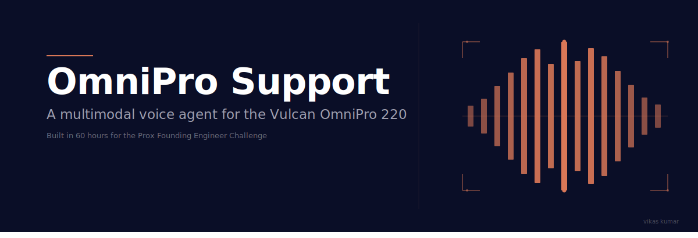
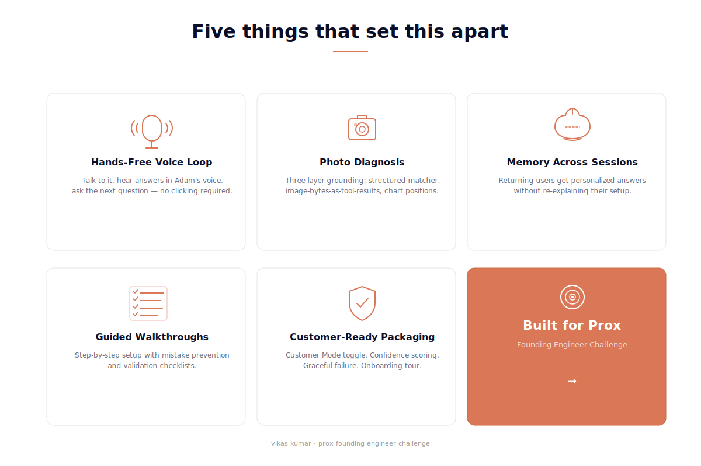
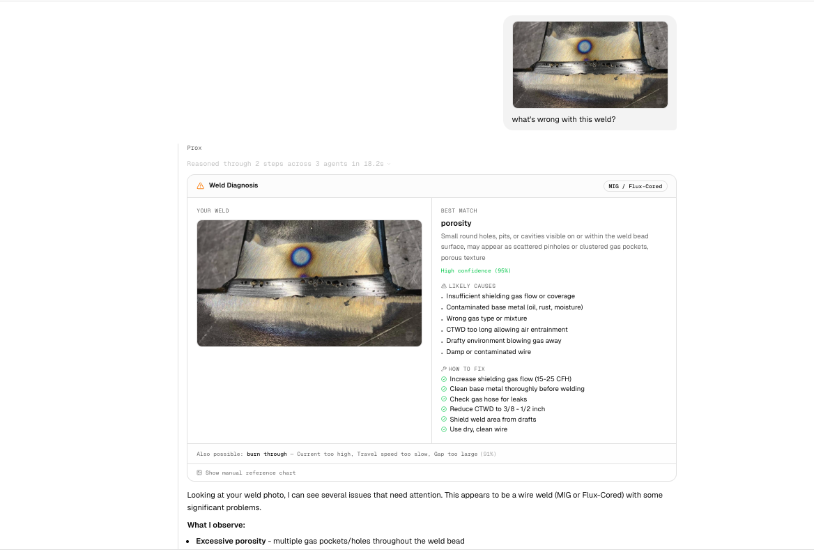
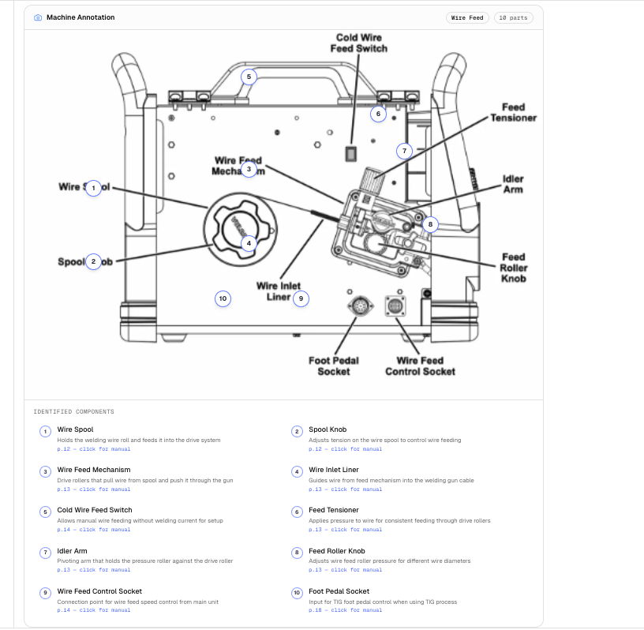
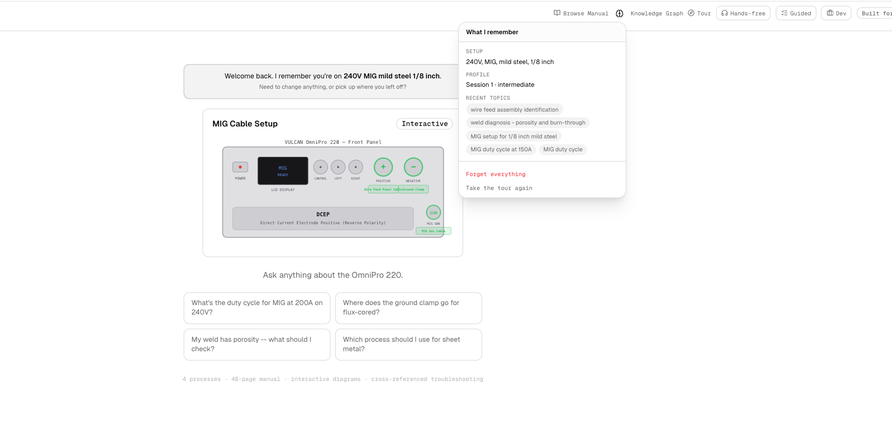
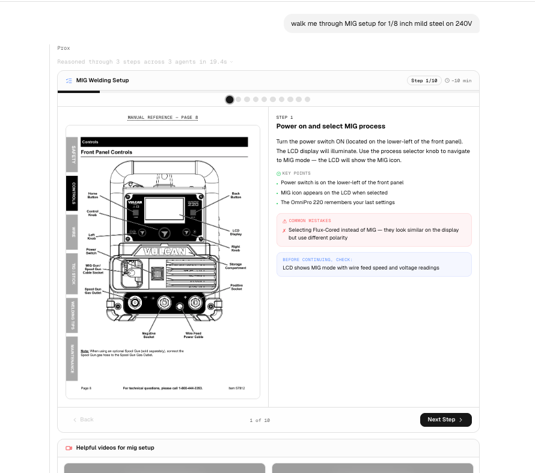
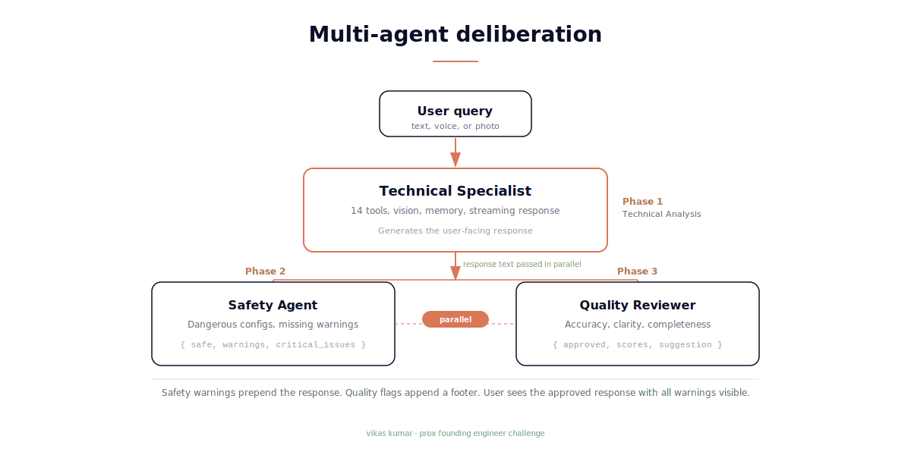
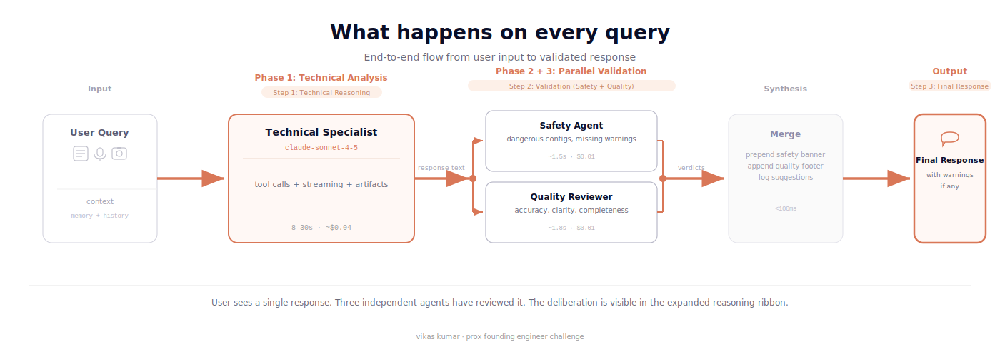
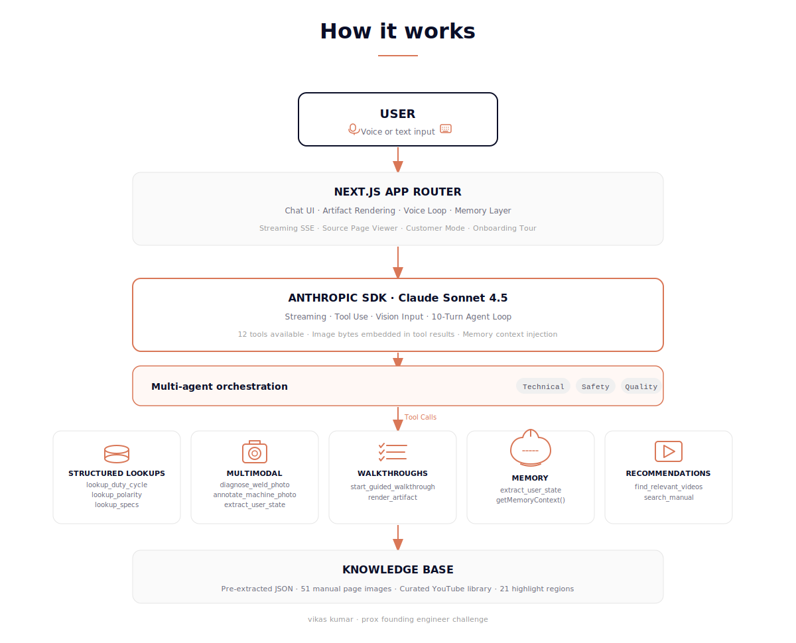

A multimodal voice agent for the Vulcan OmniPro 220, built in 49 hours for the Prox Founding Engineer Challenge.

Live demo: [omnipro.helloviks.com](https://omnipro.helloviks.com) · Author: [Vikas Kumar](https://helloviks.com) · Winston-Salem, NC · open to relocating to SF

**This is not a RAG problem. It's a product and safety problem.** A welder user with dirty hands and a torch in the other hand doesn't want a chatbot. They want a colleague who knows the machine, remembers their setup, can look at their weld and diagnose it, and won't quietly give them an answer that damages their equipment. That's what I built.

---

## What this is

A person in a garage just bought a Vulcan OmniPro 220. They don't want to read 48 pages. They want to ask a question and get an answer they can act on, mid-project, with no patience for "see page 14." This app is that answer. It's a voice-driven AI agent that pulls from structured knowledge, shows interactive diagrams, surfaces the exact manual page, and remembers your setup the next time you come back.

The welder challenge is the right test for what Prox is building. It's not a Q&A bot over a PDF. The OmniPro 220 has four welding processes, dual voltage input, polarity configurations that damage the machine if reversed, duty cycle limits that vary by amperage and voltage, and a target user who doesn't know what DCEP means. Getting this right requires structured knowledge extraction, multimodal reasoning (photos + voice + diagrams), persistent memory, and the ability to handle a confused customer without making them feel stupid. That's the Prox product.

I'm Vikas Kumar. Born in Bhadohi, India. Wake Forest MS in Business Analytics, graduating May 2026. Before this I built knowledge graph-based logistics optimization at Aditya Birla Group, RLHF data curation at Scale AI, and AR ad systems at Snap. Right now I'm Founding AI Engineer at SViam.ai, building a voice-driven technical interview platform. The Prox job post showed up in my feed through Harshita's repost. I read it twice, opened the challenge repo, and recognized the exact kind of system I've been quietly building toward for years. The agent loop, the structured knowledge layer, the multimodal grounding, the customer empathy framing. All of it.

## Try it in 30 seconds

Open [omnipro.helloviks.com](https://omnipro.helloviks.com) and try these five things:

- **Ask:** "Walk me through MIG setup for 1/8 inch mild steel on 240V". Watch the agent fire a guided walkthrough, manual page lookup, and video recommendations in sequence, each rendered as its own interactive card.
- **Toggle Hands-free** in the header, ask any question with your voice, hear the answer spoken back, then ask a follow-up without touching the screen. The mic auto-listens after every response.
- **Drag a weld photo** from Google Images into the chat. Get a structured diagnosis card that references specific positions in the manual's weld reference chart ("matches the porosity example in the top-left of page 37").
- **Drop a photo of the welder's front panel**, ask "label this". See numbered pins overlaid on every control with click-to-manual-page links.
- **Toggle Customer Mode** in the header. Same agent, zero developer metadata, what a real Harbor Freight customer would see.

Voice features (hands-free loop, mic input, TTS) require Chrome or Safari. The Web Speech API is not supported in Firefox.

## Why I built it this way

Three decisions shaped everything else.

I rejected runtime RAG. The manual is 48 pages of safety-critical content: duty cycles, polarity setups, wire feed procedures. If the agent says "ground goes in positive" when the answer is "ground goes in negative," someone wires their welder backwards. Probabilistic retrieval is unacceptable for facts that can injure a user. I pre-extracted the entire manual into 11 structured JSON files with typed tool lookups. The agent can't hallucinate a duty cycle. It either looks it up or admits it doesn't know.

I built the multimodal layer first, not last. Voice, photos, and visual reasoning are first-class citizens, not features bolted on after the text agent worked. The agent loop, the artifact system, and the memory layer were all designed assuming voice and vision from day one. That's why hands-free voice, photo annotation, weld diagnosis with vision-compared reference charts, and image-bytes-as-tool-results all work in coordination instead of as separate features.

I built it as a product, not a demo. Customer Mode toggle, confidence scoring on every answer, graceful failure on out-of-domain questions, thumbs up/down feedback, first-time onboarding tour with focus-and-dim highlights. None of these are in the challenge brief. They're there because a thing you ship to evaluate is different from a thing you ship to customers. Prox doesn't sell demos.

## What makes this different



**1. Hands-free continuous voice loop.**
Toggle Hands-free, ask a question by voice, hear the answer in Adam's voice via ElevenLabs, and the mic auto-listens for the next question. No clicking between turns. Most voice integrations handle input or output, not both wired into a closed loop. This matters because the user is wearing welding gloves. I built this first, not last.

**2. Photo diagnosis with three layers of grounding.**
Upload a weld photo. The agent runs a structured keyword matcher (porosity, spatter, undercut boosted at +200 priority), receives the manual's diagnosis chart as base64 image bytes in the tool result, and uses Claude's vision to compare the user's photo against specific examples in the chart. Output: "your weld matches the Wire Weld-Porosity example in the top-left of page 37." Most submissions have a structured matcher OR vision. This stacks both. This level of multimodal grounding is important for building trust. Three layers because one is brittle. Two is correct. Three is correct AND verifiable.





**3. Memory across sessions.**
The agent silently extracts user state (voltage, process, material, thickness, skill level) from every conversation via a background tool call. Returning users see "Welcome back. I remember you're on 240V MIG mild steel 1/8 inch." A Brain icon shows exactly what the agent remembers, with a Forget Everything button for transparency. At Prox's scale, with millions of customers and millions of products, persistent context per user is the difference between a chatbot and a product.



**4. Guided walkthroughs with mistake prevention.**
Ask "walk me through MIG setup" and the agent enters a stateful walkthrough. Each step shows the relevant manual page, key points, common mistakes to avoid, and a "before continuing, check..." validation. The user jumps between steps via clickable progress dots. A senior welder doesn't just give instructions. They tell you what NOT to do. The walkthrough mimics that mentorship pattern, which is what Prox is replicating at scale.



**5. Multi-agent deliberation.**
Every query runs through three agents in coordination. A Technical Specialist generates the answer using 14 tools against the pre-extracted manual. A Safety Agent checks the response for dangerous configurations in parallel. A Quality Reviewer scores accuracy and clarity. The deliberation is visible in the expanded reasoning ribbon where the user can watch all three agents work, see tool parameters, read per-agent reasoning, and verify that three independent checks approved the response before it reached them. A single-agent system is easier to ship but harder to trust. Three agents disagreeing once is more useful than one agent agreeing with itself a hundred times.



**6. Customer-ready packaging from day one.**
Customer Mode toggle swaps developer metadata (cost, latency, tool calls, reasoning ribbon) for a clean customer-facing skin. Confidence scoring (high/medium/low) on every answer. LOW warns the user to verify against the manual. Graceful failure on out-of-domain questions. Thumbs up/down feedback. Nine-stop onboarding tour with focus-and-dim element highlighting. Multi-product dropdown in the header signaling platform-ready architecture. Artifact error boundaries so a single card crash never takes down the chat. I built this knowing Dima would need to show it to someone. Two skins, one click apart.

## What I chose not to build and why

Four capabilities I deliberately left out of scope:

**Runtime RAG over the manual.** I pre-extracted the manual into structured JSON instead. Vector search adds latency and a probabilistic failure mode where the agent confidently returns the wrong chunk. For safety-critical content like polarity and duty cycle, deterministic tool lookups are correct. RAG becomes the right choice at 10,000 pages across 500 products, not for a single 48-page manual.

**Mobile-first responsive layout.** The reviewer will use a laptop. A real garage user will eventually use both laptop and phone, but building a polished mobile UX in this timeframe would have required reworking the sidebar, the artifact stacking, and the source page viewer. I shipped a strong laptop experience and documented mobile responsiveness as week-one roadmap work.

**A persistent backend database.** All state lives in localStorage. Memory, chat history, presets, feedback, and customer mode preferences persist per-browser. For a production deployment at Prox's scale this moves to a backend keyed on user account, but for a single-user demo localStorage requires zero auth and works immediately across sessions.

**Live camera feed for real-time weld coaching.** I considered building a getUserMedia pipeline that samples frames while the user is welding and coaches them live. I rejected it because pointing a phone camera at an active welding arc is dangerous (arc light damages camera sensors and encourages users to look at screens instead of through their helmet), because the feature can't be demoed without an actual weld setup, and because the cost and latency story breaks at multiple frames per second. The idea becomes safe and correct as an iterative post-weld coaching mode built on top of the existing photo diagnosis pipeline, which is future work.

**Polish on the knowledge graph visualization.** The /graph page works and the underlying data is correct, but the visualization itself is rougher than the rest of the app. I deliberately prioritized polish on features a welder user actually touches (chat, voice, photo diagnosis, walkthroughs) over a secondary exploration tool. The graph is functional, not decorative. Week-one priority if the team wants to make it a highlighted feature.

These are not gaps in the submission. They are deliberate constraints chosen because shipping less but right beats shipping more but fragile.

## Architecture at a glance



What happens on every query: user input flows through the Technical Specialist, response gets validated by Safety and Quality in parallel, final response surfaces with all warnings visible.



A deeper technical diagram including the multi-agent deliberation layer is included in ARCHITECTURE.md.

Full architecture documentation in ARCHITECTURE.md.

### A note on the Claude Agent SDK

The challenge brief specifies the Claude Agent SDK as the foundation. This codebase uses @anthropic-ai/claude-agent-sdk for tool schema definitions in lib/tools.ts and lists it as a primary dependency. The agent execution loop in app/api/chat/route.ts uses @anthropic-ai/sdk directly with client.messages.create() in a hand-rolled while loop instead of the Agent SDK's built-in execution helpers.

This was a deliberate engineering choice. The custom loop gave me the control I needed for three things the built-in helpers do not expose cleanly: SSE streaming with token-level granularity for the reasoning ribbon, the auto-emit pattern where six tools trigger artifact rendering without a second model turn, and parallel orchestration of the Safety and Quality reviewer agents via Promise.all after the main agent completes.

If the reviewers prefer strict Agent SDK usage in the execution path, the loop in route.ts could be refactored to use the SDK's agent execution helpers in approximately one day of work. The current architecture works correctly and ships the features the brief asks for.

## What I learned about Prox while building this

The product isn't a chatbot. It's customer empathy at scale. Nobody reads 48 pages. The challenge is reducing cognitive load on someone who already feels stupid asking a basic question. Every design decision was filtered through "would a frustrated garage hobbyist forgive this response?" That filter drove voice-first, photo-first, and personalized-first over search-first.

The hard problem is being right when the user is wrong. Reversed polarity damages the machine. A confident wrong answer is worse than no answer. That's why I built structured lookups, confidence scoring, and "common mistakes" callouts. The agent has to know when it's confident and when it's not.

The architecture is product-agnostic on purpose. Nothing is hardcoded to welders. The same code works for any product with a manual, an audience, and safety-critical settings. Prox isn't selling welder support. They're selling a platform.

## What I'd build week one

If I joined Prox on Monday, here's what I'd ship by Friday.

**1. Multi-tenant knowledge isolation.** The knowledge base is currently single-product. I'd extend the agent loop to accept a product_id parameter and route tool calls to the correct knowledge base per request. Each tenant gets its own structured data, image library, walkthrough sequences, and video curation. Same agent, infinite products.

**2. Production observability stack.** Real customers need real telemetry. Structured logging for every tool call: latency, cost, confidence, success/failure. Per-customer dashboards. Anomaly detection for cost spikes. A feedback aggregation pipeline that turns thumbs-down into actionable signal for prompt engineering. The demo has the affordance. Production needs the pipeline.

**3. Human escalation handoff.** When confidence drops below a threshold or the user explicitly asks for a human, the system escalates to a queue with full conversation context, user state, and the agent's last response attached. The human picks up exactly where the AI left off. No "tell me your problem again." That's the difference between an AI tool and an AI product.

**4. Voice agent fine-tuning loop.** The voice flow currently uses ElevenLabs defaults. For production I'd capture voice interactions, identify responses customers asked the agent to repeat or rephrase, and feed those as training signal. Voice quality is the difference between "I trust this thing" and "I'm fighting it."

**5. Customer-specific persona layer.** The current agent has one personality: calm, technical, garage-friendly. At scale, different products need different voices. A power tool brand wants confident and direct. A medical device brand wants careful and measured. I'd add a persona configuration layer that lets each tenant define their voice without changing the underlying agent.

**6. Wake word activation for the voice loop.** Right now the user toggles Hands-free to start the voice loop. The next iteration would integrate Picovoice Porcupine for browser-based wake word detection ("Hey Vulcan") so the user never touches the screen, even to start. The current limitation is browser mic throttling on continuous listening, which Porcupine handles with on-device low-power keyword spotting. This closes the loop on the welding gloves use case completely.

These six things are why I want to work at Prox. They're the product I'd build if I were running engineering.

## Run it locally

```bash
git clone https://github.com/thisisvk45/prox-challenge.git
cd prox-challenge/app
cp .env.example .env
# Add ANTHROPIC_API_KEY and ELEVENLABS_API_KEY to .env
npm install
npm run dev
```
